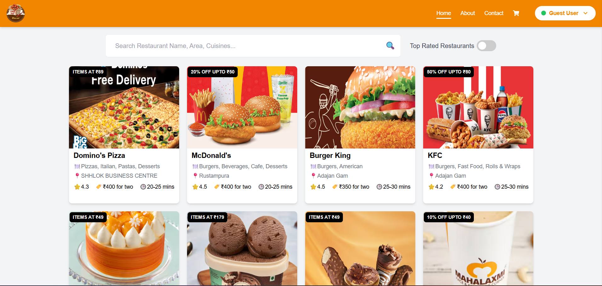
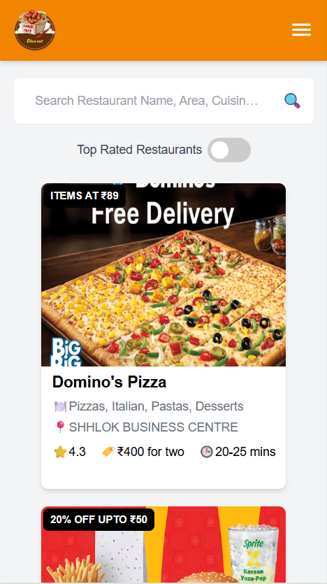

# 🍽️ Dine Out: Swiggy Clone to Restaurants

A responsive and dynamic restaurant menu application inspired by Swiggy. Built with React, Redux, Tailwind CSS, and React Router, DineOut offers a seamless user experience for exploring restaurant menus, managing a cart, and viewing restaurant details.

---

## 🚀 **Live Demo**

[View Live Application](https://dine-out-fe.netlify.app/)

---

## 📌 **Features**

- 🚀 **Responsive Design:** Optimized for both desktop and mobile devices.
- ⚡ **Shimmer Loading UI:** Enhanced shimmer effect for a smooth loading experience.
- 📃 **Dynamic Menu Categories:** Expandable and collapsible menu categories.
- 🛒 **Cart Management:** Add, remove, and view items in the cart.
- 🔄 **Persistent Cart State:** Cart state managed with Redux.
- ✨ **Interactive Modals:** Confirmation modals for adding/removing items.
- 🌐 **Error Handling:** Clear error messages for failed API requests.

---

## 📸 **Screenshots**

| Desktop View                                     | Mobile View                                    |
| ------------------------------------------------ | ---------------------------------------------- |
|  |  |

---

## 🛠️ **Tech Stack**

- **Frontend:** React.js, React Router DOM
- **State Management:** Redux Toolkit
- **Styling:** Tailwind CSS
- **Icons:** React Icons
- **API Integration:** FoodFire Server (Custom API)
- **Custom Hooks:** Optimized code with custom hooks

---

## 🌐 **API Information**

### 🟢 **Base API URL**

- The application uses a custom server API to bypass CORS issues from Swiggy API:
  ```bash
  https://foodfire.onrender.com
  ```

### ❌ Why Not Swiggy API?

- The Swiggy API has strict CORS policies, making direct API calls from the client-side impossible.

- To overcome this, [Chetannada](https://github.com/chetannada) created FoodFire Server, a proxy server that securely fetches data from Swiggy and provides it to the client without CORS issues.

- `GitHub`: [FoodFire Server on GitHub](https://github.com/chetannada/FoodFire-Server)

## 🚦 Project Structure

```push
src/
├── components/           # Reusable components
├── context/              # React Context for user management
├── hooks/                # Custom Hooks
├── store/                # Redux store and slices
├── utils/                # Utility functions and constants
└── App.js                # Main App component

```

## 🚀 Usage Guide

### 🏠 Home Page

- Displays the list of restaurants with a brief overview.

### 📋 Restaurant Menu Page

- Shimmer UI is displayed while data is loading.

- Menu categories are collapsible.

- Add and remove items from the cart.

- Cart state is managed using Redux.

### 🛒 Cart Management

- Add items to the cart.

- Remove items from the cart.

- Cart total is dynamically updated.

### ⚡ Responsive Design

- Fully optimized for both desktop and mobile screens.

- Dynamic layout adjustments for a better user experience.

### 🚨 Error Handling

- If API fails, a user-friendly error message is displayed.

- Proper fallback UI for missing data.

### 💡 Custom Hooks

- `useRestaurantMenu`: Fetches restaurant menu data using the FoodFire API.

- `useOnline`: Monitors network status (online/offline).

- `useSimpleConfirm`: Custom hook for confirmation modal (for cart actions).

### 📌 FoodFire Server: How it works

- The FoodFire Server is a proxy server that fetches restaurant data from the Swiggy API and provides it to the client.

- This server is hosted on Render and can be accessed publicly.

- The source code for the server is available here:

- `GitHub`: [FoodFire Server on GitHub](https://github.com/chetannada/FoodFire-Server)

- Example API Endpoints:

```
Get Restaurant List: https://foodfire.onrender.com/api/restaurants

Get Restaurant Menu: https://foodfire.onrender.com/api/menu/:resId
```

### 📌 Future Enhancements

- 🌐 Add user authentication and profile management.

- 💬 Add user reviews for each menu item.

- 📊 Display order history for logged-in users.

## ⚙️ Installation

### 1️⃣ Clone the Repository

```bash
git clone https://github.com/mahak-23/dine-out.git
cd dine-out
```

### 2️⃣ Install Dependencies

```bash
npm install
```

### 3️⃣ Set API Base URL (Optional)

- By default, the app uses https://foodfire.onrender.com as the API URL.

- To use a different API URL, update the base URL in your API utility file (src/utils/constant.js):

```javascript
export const API_BASE_URL = "https://foodfire.onrender.com";
```

### 4️⃣ Run the Application

```bash
npm start
```

### 5️⃣ Build for Production

```bash
npm run build
```

# 💖 Contributing

Contributions are welcome! Please fork the repository and create a pull request.
