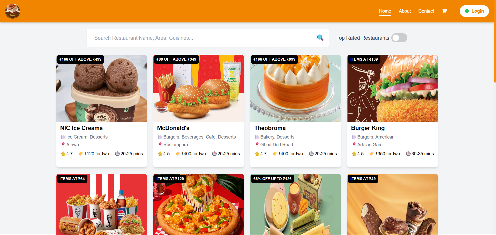

# 🍽️ Dine Out: Swiggy Clone to Restaurants

A responsive and dynamic restaurant menu application inspired by Swiggy. Built with React, Redux, Tailwind CSS,React Router, Firebase Authentication, and Webpack for optimized performance. DineOut offers a seamless user experience for exploring restaurant menus, managing a cart, and viewing restaurant details.

---

## 🚀 **Live Demo**

[View Live Application](https://dine-out-fe.netlify.app/)

---

## 📌 **Features**

- 🚀 **Responsive Design:** Optimized for both desktop and mobile devices.
- ⚡ **Shimmer Loading UI:** Enhanced shimmer effect for a smooth loading experience.
- 📃 **Dynamic Menu Categories:** Expandable and collapsible menu categories.
- 🛒 **Cart Management:**
  - Add, remove, and view items in the cart.
  - Persistent cart state managed with Redux.
  - Cart state maintained even after user login if previous user was not logged in.
- 🔒 **User Authentication with Firebase:**
  - Login and signup with email/password.
  - Persistent user sessions using Firebase Authentication.
  - Redirect to the last page after login (cart page for checkout).
- 💳 **Checkout and Payment:**
  - Dynamic Bill calculation with GST, platform fee, and delivery charges.
  - Checkout only for logged-in users.
  - Automatic redirect to login if not logged in during checkout.
- 🔄 **Logout and Cart Management:**
  - Cart is cleared on user logout.
- 🌐 **Webpack Configuration:**
  - Optimized build with Webpack for fast loading.
  - Code splitting and lazy loading for enhanced performance.
- ⚡ **Error Handling:**
  - Clear error messages for failed API requests.
  - Graceful fallback UI for network errors.

---

## 📸 **Screenshots**

| Desktop View                                     | Mobile View                                    |
| ------------------------------------------------ | ---------------------------------------------- |
|  |  |

---

## 🛠️ **Tech Stack**

- **Frontend:** React.js, React Router DOM, Redux Toolkit
- **Styling:** Tailwind CSS
- **Authentication:** Firebase Authentication (Email/Password)
- **State Management:** Redux Toolkit with Context API for User Management
- **Bundling:** Webpack
- **Icons:** React Icons
- **API Integration:** Custom FoodFire Server (for restaurant data)
- **Custom Hooks:** Optimized code with reusable hooks

---

## 🌐 **API Information**

### 🟢 **Base API URL**

- The application uses a custom server API to bypass CORS issues from Swiggy API:
  ```bash
  https://foodfire.onrender.com
  ```

### ❌ Why Not Swiggy API?

- The Swiggy API has strict CORS policies, making direct API calls from the client-side impossible.

- To overcome this, [Chetannada](https://github.com/chetannada) created FoodFire Server, a proxy server that securely fetches data from Swiggy and provides it to the client without CORS issues.

- `GitHub`: [FoodFire Server on GitHub](https://github.com/chetannada/FoodFire-Server)

## 🚦 Project Structure

```push
src/
├── components/           # Reusable components
├── context/              # React Context for user management
├── hooks/                # Custom Hooks
├── store/                # Redux store and slices
├── utils/                # Utility functions and constants
├── services/             # Firebase configuration and utilities
└── App.js                # Main App component

```

## 🚀 Usage Guide

### 🏠 Home Page

- Displays the list of restaurants with a brief overview.

- Click on a restaurant to view its menu.

### 📋 Restaurant Menu Page

- Shimmer UI is displayed while data is loading.

- Menu categories are collapsible.

- Add and remove items from the cart.

- Cart state is managed using Redux.

### 🛒 Cart Management

- Add items to the cart.

- Remove items from the cart.

- Cart total is dynamically updated.

- Cart state persists even after login if previous user was not logged in.

- Clear cart automatically on logout.

### 🔒 User Authentication (Login & Signup)

- Firebase Authentication with email/password.

- Login to save cart state and access checkout.

- Logout clears cart and redirects to home.

### 💳 Checkout Payment

- 🚫 `Login Required:` Users must be logged in to proceed with the checkout.
- 📝 `Dynamic Bill Calculation:` The bill is calculated based on:

  - `Item Total:` Sum of the prices of all items in the cart.
  - `Delivery Fee (Fixed):` A fixed delivery fee of ₹40.
  - `Platform Fee:` A platform usage fee of ₹5.
  - `GST (5%):` Calculated on the item total.
  - `Custom Delivery Tip:` Optional user-defined tip for delivery personnel.

- 🚀 `Checkout Flow:`

  1. `User Clicks on 'Checkout':`

     - If the user is `logged in`, they proceed directly to the payment page.
     - If the user is `not logged in`, they are redirected to the login page.
     - After successful login, they are redirected back to the cart page to complete the payment.

  2. `Bill Summary Display:`

     - The bill summary displays a detailed breakdown:
       - Item Total
       - Delivery Fee
       - Platform Fee
       - GST
       - Custom Tip (if any)
       - Total to Pay

  3. `Payment Confirmation:`
     - After a successful payment, a success message is displayed.
     - The cart is cleared automatically after payment.

### 🌐 Webpack Optimization

- 🚀 `Optimized Build Configuration:`

  - The project uses a custom Webpack configuration for faster builds and optimized performance.

- 🗂️ `Code Splitting:`

  - React components are dynamically imported using React's `lazy` and `Suspense`.
  - Pages and heavy components are loaded only when needed, reducing initial load time.

- 📊 `Bundle Analysis:`

  - Webpack's `BundleAnalyzerPlugin` is used to visualize the build size and optimize the bundle.

- 📦 `Efficient Bundling:`

  - CSS and JS files are minified using `TerserPlugin` and `CssMinimizerPlugin`.
  - Duplicate code is removed using `SplitChunksPlugin`.
  - Tree Shaking is enabled to remove unused code.

- 📸 `Image Optimization:`

  - Images are optimized using `image-webpack-loader` for smaller file sizes.
  - Lazy loading is used for images to improve page load speed.

- ⚡ `Development Mode:`

  - Hot Module Replacement (HMR) for faster development.
  - Source Maps enabled for better debugging.

- 📌 `Production Mode:`
  - Minified JS and CSS for faster loading.
  - Code splitting and tree shaking for optimized performance.
  - Gzip compression for faster asset delivery.

### ⚡ Responsive Design

- Fully optimized for both desktop and mobile screens.

- Dynamic layout adjustments for a better user experience.

### 🚨 Error Handling

- If API fails, a user-friendly error message is displayed.

- Proper fallback UI for missing data.

### 💡 Custom Hooks

- `useRestaurantMenu`: Fetches restaurant menu data using the FoodFire API.

- `useOnline`: Monitors network status (online/offline).

- `useSimpleConfirm`: Custom hook for confirmation modal (for cart actions).

### 📌 FoodFire Server: How it works

- The FoodFire Server is a proxy server that fetches restaurant data from the Swiggy API and provides it to the client.

- This server is hosted on Render and can be accessed publicly.

- The source code for the server is available here:

- `GitHub`: [FoodFire Server on GitHub](https://github.com/chetannada/FoodFire-Server)

- Example API Endpoints:

```
Get Restaurant List: https://foodfire.onrender.com/api/restaurants

Get Restaurant Menu: https://foodfire.onrender.com/api/menu/:resId
```

### 📌 Future Enhancements

- 🌐 Add Google Login with Firebase Authentication.

- 📊 Display order history for logged-in users.

- 🛡️ Add user profile and order management.

- 💬 Add user reviews for each menu item.

- 🚀 Optimize performance with React Server Components.

## ⚙️ Installation

### 1️⃣ Clone the Repository

```bash
git clone https://github.com/mahak-23/dine-out.git
cd dine-out
```

### 2️⃣ Install Dependencies

```bash
npm install
```

### 3️⃣ Firebase Configuration

- Create a Firebase project at [Firebase Console](https://console.firebase.google.com).

- Obtain Firebase configuration credentials.

- Create a `.env` file in the project root:

```bash
REACT_APP_FIREBASE_API_KEY=your_firebase_api_key
REACT_APP_FIREBASE_AUTH_DOMAIN=your_firebase_auth_domain
REACT_APP_FIREBASE_PROJECT_ID=your_firebase_project_id
REACT_APP_FIREBASE_STORAGE_BUCKET=your_firebase_storage_bucket
REACT_APP_FIREBASE_MESSAGING_SENDER_ID=your_firebase_messaging_sender_id
REACT_APP_FIREBASE_APP_ID=your_firebase_app_id
```

### 4️⃣ Set API Base URL (Optional)

- By default, the app uses https://foodfire.onrender.com as the API URL.

- To use a different API URL, update the base URL in your API utility file (src/utils/constant.js):

```javascript
export const API_BASE_URL = "https://foodfire.onrender.com";
```

### 5️⃣ Run the Application

```bash
npm start
```

### 6️⃣ Build for Production

```bash
npm run build
```

### 7️⃣ Deploy (Netlify/Firebase/Vercel)

- For Netlify: Connect the GitHub repository.

- For Firebase Hosting: Use firebase init and firebase deploy.

# 💖 Contributing

Contributions are welcome! Please fork the repository and create a pull request.
